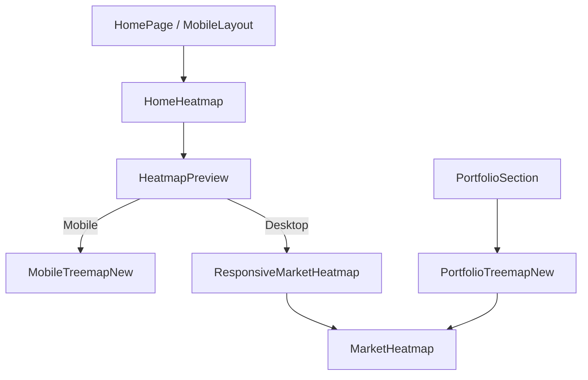

# UX Code Architecture Report: Heatmap & Mobile Experience

This report analyzes the User Experience (UX) implementation of the codebase, focusing on the **Heatmap** architecture and the **Mobile-First** design strategy.

## 1. Core UX Strategy: "Mobile First, Desktop Robust"
The application uses a bifurcated strategy for rendering High-Density Information (HDI) like the Stock Market Heatmap.

*   **Mobile UX**: Prioritizes vertical scrolling, touch capability, and immediate readability.
*   **Desktop UX**: Prioritizes density, panoramic overview, and mouse-hover interactivity.

## 2. Heatmap Architecture (`MarketHeatmap` Ecosystem)
The Heatmap is not a single component but a system of specialized implementations sharing a core D3 engine.

### A. The Mobile Experience (`MobileTreemapNew.tsx`)
This is the default view on mobile devices (Tab 1).
*   **Vertical "Stack" Layout**: Unlike traditional treemaps that try to fill a 16:9 rectangle, the mobile heatmap stacks **Sectors** vertically.
    *   *UX Rationale*: Users are accustomed to vertical scrolling feeds. A squarified 16:9 map on mobile generates tiny, unreadable tiles. By stacking sectors, we ensure each sector grabs enough full-width screen real estate.
*   **Interactions (Touch-Centric)**:
    *   **Tap-to-Detail**: Zero tooltips. Tapping a tile opens a **Bottom Sheet** overlay.
    *   **Bottom Sheet UX**: Contains larger typography, clear "Add to Favorites" toggle, and a breakdown of Price, Market Cap, % Change, and $ Change.
*   **Performance (Virtualization)**:
    *   Small tiles (< 0px visible area) are filtered out to reduce DOM weight.
    *   Uses **DOM Rendering** (divs) instead of Canvas on mobile to ensure crisp text rendering and reliable touch events.

### B. The Portfolio Experience (`PortfolioTreemapNew.tsx`)
A specialized variant for the Portfolio Dashboard.
*   **Key UX Decision - Visual Weighting**:
    *   **Size**: Determined by **Absolute Daily P&L** ($).
    *   **Color**: Determined by **Daily % Change** (Green/Red).
    *   *UX Rationale*: A standard heatmap sizes by Market Cap. In a portfolio, a user cares most about *which position impacts their Net Worth today*. A small position up 50% might matter less than a huge position down 2%. This logic visualizes "Impact".

### C. The Desktop Experience (`MarketHeatmap.tsx`)
*   **Canvas Rendering**: Switches to `<canvas>` for rendering 500+ tickers at 60fps.
*   **Interactive Zoom**: Clicking a sector isolates it, re-calculating the squarified layout for that specific subset.
*   **Hover Tooltips**: Instant feedback on mouseover using a fixed-position overlay to prevent clipping.

## 3. Navigation & Layout UX (`MobileLayout.tsx`)
*   **Tab-Based Navigation**: 5-tab system (Heatmap, Portfolio, Favorites, Earnings, All Stocks).
*   **Physics-Based Transitions**: Uses `Framer Motion` to slide screens efficiently (`x: '100vw'`).
    *   *Directional Awareness*: Memorizes the previous tab index to slide Left-to-Right or Right-to-Left, reinforcing spatial mental models.
*   **Viewport Management**: Explicit handling of iOS Safari's dynamic address bar via `--app-height` calculation.

## 4. Code Component Hierarchy

## 5. Visual Feedback & Micro-Interactions
*   **Loading States**: Custom Skeletons (pulsing gray blocks) match the exact layout of the expected content to reduce Layout Shift (CLS).
*   **Empty States**: Portfolio treemap collapses gracefully or shows prompts when data is missing.
*   **Color Logic**:
    *   **Green/Red**: Standard +/- movement.
    *   **Black/Dark Gray Background**: High contrast for financial data, reduces eye strain, and implies "Pro" tool feel.

## 6. Recommendations for AI Context
When feeding this to an LLM/GPT for further work:
1.  **Mention the Split**: Always clarify if a requested change is for `MobileTreemapNew` (the vertical stack) or `MarketHeatmap` (the core canvas engine).
2.  **Data Flow**: Data enters via `useStocks` -> `HomeHeatmap` -> `ResponsiveMarketHeatmap` -> processes via D3 `hierarchy` -> renders via React/Canvas.
3.  **Critical Constraints**: The Mobile Heatmap *must* scroll. It uses `d3-hierarchy` but manually calculates sector heights based on the viewport width to force a scrollable column.
